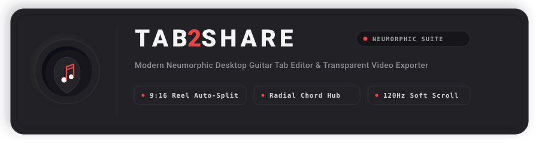
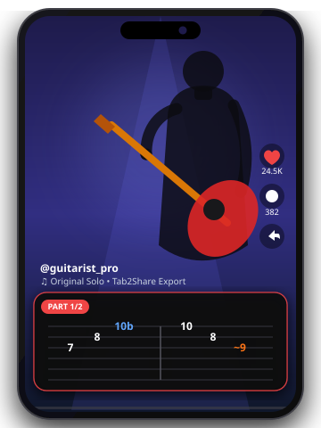

<div align="center">

<!-- Animated Main Banner -->


<br /><br />

```
 _____ ___  ____  ____  ____  _   _    _    ____  _____ 
|_   _/ _ \| __ )|___ \/ ___|| | | |  / \  |  _ \| ____|
  | || |_| |  _ \  __) \___ \| |_| | / _ \ | |_) |  _|  
  | ||  _  | |_) |/ __/ ___) |  _  |/ ___ \|  _ <| |___ 
  |_||_| |_|____/|_____|____/|_| |_/_/   \_\_| \_\_____|
       Modern Neumorphic Guitar Tab & Reel Suite        
```

<p align="center">
  <b>Tab2Share</b>, gitaristler ve müzik içerik üreticileri (Instagram Reels, TikTok, YouTube Shorts) için özel tasarlanmış; dokunsal <b>Skeuomorphic / Neumorphic (Soft UI)</b> arayüze, 120Hz akıcı kaydırmaya ve doğrudan video overlay'ine uygun şeffaf PNG export motoruna sahip yeni nesil bir masaüstü gitar tab ve akor düzenleyicisidir.
</p>

<!-- Tech Badges -->
<p align="center">
  
  
  
  
  
</p>

<br />

[Özellikler](#özellikler) •
[Neumorphic Mimari](#neumorphic-soft-ui-mimarisi) •
[Reel & TikTok Export](#3-reel--tiktok-için-şeffaf-export) •
[Klavye Kısayolları](#klavye-kısayolları) •
[Kurulum ve Çalıştırma](#kurulum-ve-çalıştırma)

---

</div>

<br />

## Özellikler

### 1. Vektörel Tab Tuvali & Gerçek Zamanlı Efektler

Tab2Share'in notalama motoru, 2K/4K ekranlarda piksel bozulması olmadan pürüzsüz vektörel nota çizer.

<div align="center">
  
</div>

- **Dinamik Bend Okları:** Bend derecesine (`½`, `full`, `1½`) göre sağa kıvrılarak en üst tele yükselen oklar (`▲`) ve yayın bırakılması (`bendRelease` / `▼`).
- **Canlı Vibrato:** Tab çizgilerinin üzerine konumlanan dalgalı vibrato sembolleri.
- **Yönlü Slaytlar (Slides):** Nota soluna hizalanan `/` (aşağıdan) ve `\` (yukarıdan) slide gösterimleri.
- **Palm Mute & Let Ring:** Ölçüler boyunca uzanan alt braketler (`PM ───|`, `let ring ───|`).
- **Yüzen Neumorphic Scrollbar:** Ekran yüksekliğini sıkıştırmayan, saydam ve Logitech MX Master 3S yanal tekerleğiyle (thumb-wheel) senkronize 120Hz akıcı kaydırma.

---

### 2. Dairesel Akor Çarkı (Radial Chord Wheel)

Klasik sıkıcı buton ızgaraları yerine dokunsal bir çark mimarisi!

<table>
  <tr>
    <td width="55%">
      <h4>İnteraktif Dairesel Çark:</h4>
      <ul>
        <li><b>30+ Hazır Akor:</b> Major, Minor, Seventh, Sus ve Power akor aileleri.</li>
        <li><b>Merkeze Açılan SVG Popover:</b> Herhangi bir akor butonunun üzerine gelindiğinde, çarkın merkezine (hub) doğru tema uyumlu minyatür akor diyagramı açılır.</li>
        <li><b>Dışarı Taşmayan Geometri:</b> Alt butonlara (D, E vb.) gelindiğinde diyagram yukarı doğru açılarak panel sınırları içinde kalır.</li>
        <li><b>Canlı Yeniden Adlandırma:</b> Notalara özel akor etiketleri tanımlayabilme.</li>
      </ul>
    </td>
    <td width="45%" align="center">
      
    </td>
  </tr>
</table>

---

### 3. Reel & TikTok İçin Şeffaf Export

Video kurgu programlarında (CapCut, Premiere Pro, DaVinci Resolve) kullanmak üzere özel olarak optimize edilmiş çıktı motoru.

<table>
  <tr>
    <td width="45%" align="center">
      
    </td>
    <td width="55%">
      <h4>Sosyal Medya Odaklı Export:</h4>
      <ul>
        <li><b>9:16 Dikey Format (1080 × 1920 px):</b> Ölçü sınırlarından taşmadan 4 satıra bölünmüş, dikey video uyumlu hazır görsel.</li>
        <li><b>Tek Uzun Şerit:</b> Yatay kaydırma animasyonları için tek satır kesintisiz şerit.</li>
        <li><b>Şeffaf Alpha Kanalı:</b> Siyah kutu olmadan, videonuzun üzerine doğrudan yerleşen şeffaf PNG çıktısı.</li>
        <li><b>Akıllı Parçalama (Part Splitting):</b> 4 satıra sığmayan uzun sololar otomatik olarak okunabilirlik bozulmadan <code>{proje}_part1.png</code>, <code>{proje}_part2.png</code> olarak dışa aktarılır.</li>
      </ul>
    </td>
  </tr>
</table>

---

## Neumorphic (Soft UI) Mimarisi

Tab2Share, düz (flat) grafikler yerine gerçek bir stüdyo donanımı hissi veren **Skeuomorphic Soft UI** prensibine dayanır:

```
┌────────────────────────────────────────────────────────────────────────┐
│                        TAB2SHARE SURFACE SYSTEM                        │
├────────────────────────────────┬───────────────────────────────────────┤
│ 1. Raised Surface (.raised)    │ Butonlar, pedallar ve yüzen paneller. │
│                                │ Dışa doğru kabaran çift ışık/gölge.   │
├────────────────────────────────┼───────────────────────────────────────┤
│ 2. Inset Surface (.inset)      │ Aktif perdeler ve basılı butonlar.    │
│                                │ Gövdeye gömülen iç gölge çifti.       │
├────────────────────────────────┼───────────────────────────────────────┤
│ 3. Digital Well (.tab-screen)  │ Tab tuvali: Cihazın cam ekranıdır.    │
│                                │ Gömük rim ve ultra-net kontrast.      │
└────────────────────────────────┴───────────────────────────────────────┘
```

- **Işık ve Gölge Fiziği:** Renkler yapay siyah/beyaz değil; gövdenin kendi tonunun 145 derece açıyla aydınlatılmış ve karartılmış kopyalarıdır.
- **Karanlık Mod Yumuşatması:** Gözü yormayan yumuşak 2.5px mesafeli, difüze koyu tema gölgeleri.

---

## Klavye Kısayolları

Fareye dokunmadan klavyeden anında tab yazımı:

| Kısayol | Kategori | Açıklama |
| :---: | :---: | :--- |
| <kbd>0</kbd> – <kbd>24</kbd> | **Giriş** | Seçili tel üzerine perde numarasını yazar |
| <kbd>R</kbd> | **Giriş** | Seçili vuruşa Es (Rest) ekler |
| <kbd>F1</kbd> – <kbd>F6</kbd> | **Süre** | Vuruş süresini değiştirir (Birlik - 32'lik) |
| <kbd>.</kbd> | **Süre** | Noktalı nota (Dotted) aç/kapat |
| <kbd>T</kbd> | **Süre** | Üçleme (Tuplet / Triplet) aç/kapat |
| <kbd>B</kbd> | **Efekt** | Bend modunu aç/kapat (½, full, 1½, release) |
| <kbd>V</kbd> / <kbd>Alt+V</kbd> | **Efekt** | Normal / Geniş Vibrato uygular |
| <kbd>H</kbd> | **Efekt** | Hammer-on / Pull-off bağlar |
| <kbd>X</kbd> | **Efekt** | Ölü Nota (Dead Note) yapar |
| <kbd>O</kbd> | **Efekt** | Hayalet Nota (Ghost Note - parantez içi) |
| <kbd>[</kbd> | **Efekt** | Palm Mute aralığı başlatır/kapatır |
| <kbd>I</kbd> | **Efekt** | Let Ring (Tınlasın) aralığı başlatır/kapatır |
| <kbd>Ctrl</kbd> + <kbd>M</kbd> | **Ölçü** | Araya yeni ölçü ekler |
| <kbd>Ctrl</kbd> + <kbd>D</kbd> | **Ölçü** | Aktif ölçüyü birebir çoğaltır |
| <kbd>Ctrl</kbd> + <kbd>Shift+M</kbd> | **Ölçü** | Aktif ölçüyü siler |
| <kbd>Ctrl</kbd> + <kbd>↑</kbd> / <kbd>↓</kbd> | **Müzik** | Seçili notayı / ölçüyü yarım ses transpoze eder |
| <kbd>Ctrl</kbd> + <kbd>E</kbd> | **Export** | Sosyal Medya PNG Dışa Aktarma Menüsü |

---

## Proje Dizin Yapısı

```
Tab2Share/
├── public/                 # Animasyonlu SVG demoları ve logolar
│   ├── banner.svg          # Animasyonlu başlık banner'ı
│   ├── demo-tab.svg        # Animasyonlu tab canvas demosu
│   ├── demo-wheel.svg      # Animasyonlu akor çarkı demosu
│   └── demo-reel.svg       # Animasyonlu 9:16 Reel export demosu
├── src/
│   ├── editor/             # Akor çarkı, fretboard, süre ve ölçü kontrolleri
│   │   ├── ChordPicker.tsx # 30-Akor dairesel çark bileşeni
│   │   ├── ChordDiagram.tsx# Vektörel dinamik akor diyagramı
│   │   └── ui/             # NeumorphicScrollbar, SkeuButton bileşenleri
│   ├── render/             # HTML5 Canvas 2D çizim motoru
│   │   ├── layout.ts       # Notalama geometri ve ölçü yerleşim matematiği
│   │   ├── drawTab.ts      # Vektörel bend, vibrato, slide çizim motoru
│   │   └── TabCanvas.tsx   # Yüksek çözünürlüklü canvas bileşeni
│   ├── theme/              # Dual Neumorphic tema yöneticisi
│   ├── App.tsx             # Ana uygulama kabuğu ve 120Hz smooth scroll döngüsü
│   └── index.css           # Neumorphic çift gölge kuralları
├── src-tauri/              # Rust / Tauri 2.0 masaüstü backend
├── package.json
└── README.md
```

---

## Kurulum ve Çalıştırma

### Ön Gereksinimler
- [Node.js](https://nodejs.org/) (v18 veya üzeri)
- [Rust & Cargo](https://www.rust-lang.org/) (Masaüstü Tauri uygulaması derlemek için)

### 1. Depoyu Klonlayın ve Bağımlılıkları Yükleyin
```bash
git clone https://github.com/your-username/Tab2Share.git
cd Tab2Share
npm install
```

### 2. Geliştirici Modunda Web Üzerinde Çalıştırma
```bash
npm run dev
```
> Varsayılan olarak `http://localhost:1420/` adresinde çalışır.

### 3. Yerel Masaüstü Uygulaması Olarak Çalıştırma (Tauri)
```bash
npm run tauri dev
```

### 4. Üretim (Production) Derlemesi Alma
```bash
npm run build
```

---

<div align="center">

Made with passion for Guitarists & Music Creators.

</div>
